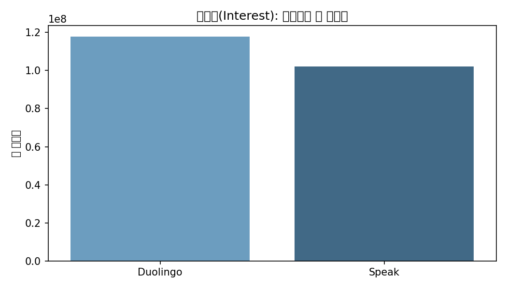
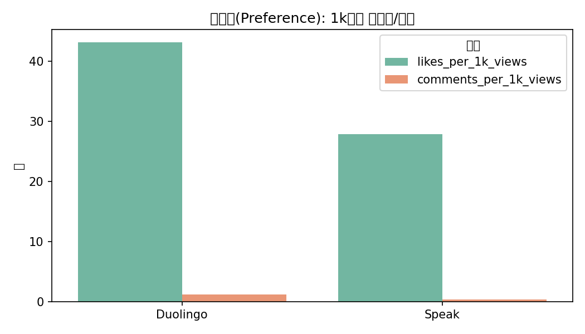
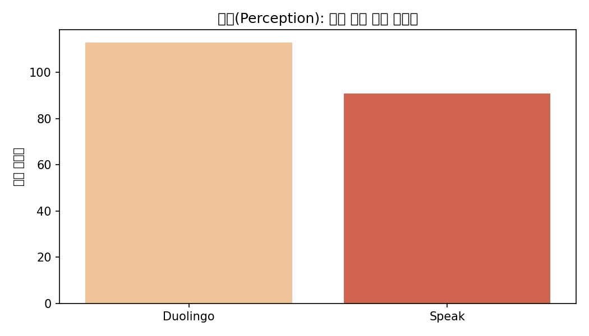
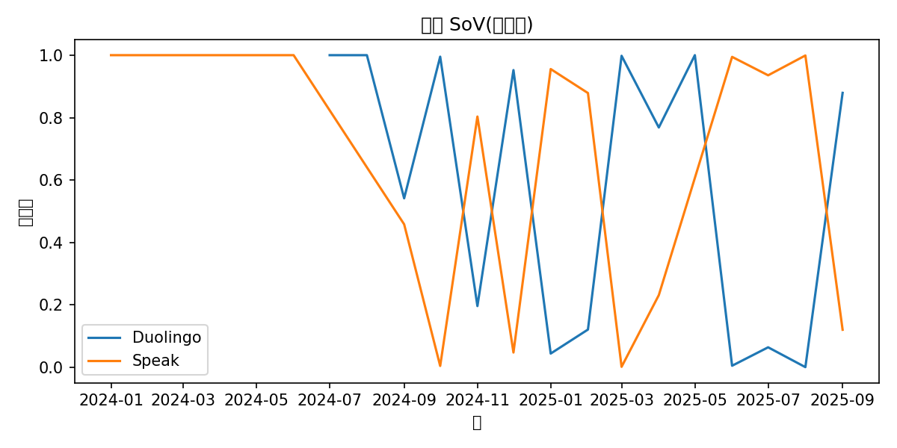

## YouTube 수집 데이터 분석

- 생성시각: 2025-09-29 17:50:02


### 분석 방법
- videos: 브랜드별 영상수, 조회수/좋아요/댓글 합계 및 평균 산출
- comments: 브랜드별 상위 댓글 수 합계
- SoV: 월별 점유율 테이블에서 최신 월을 요약

### 브랜드별 핵심 지표
| brand | videos | views | likes | comments | avg_views_per_video | avg_likes_per_video | avg_comments_per_video |
| --- | --- | --- | --- | --- | --- | --- | --- |
| Duolingo | 38 | 117682838 | 5075747 | 146082 | 3096916.79 | 133572.29 | 3844.26 |
| Speak | 36 | 102152600 | 2846999 | 41388 | 2837572.22 | 79083.31 | 1149.67 |

### 브랜드별 상위 댓글 수
| brand | total_top_level_comments |
| --- | --- |
| Duolingo | 11051 |
| Speak | 6349 |

### 브랜드별 영상 업로드 상위 채널
| brand | channel_title | video_count |
| --- | --- | --- |
| Duolingo | Duolingo | 18 |
| Duolingo | 대신TV | 2 |
| Duolingo | 쌤아카데미 | 2 |
| Duolingo | 아이템의 인벤토리 | 2 |
| Duolingo | MG | Sean Kim | 1 |
| Duolingo | SOUND GRAB | 1 |
| Duolingo | jiyu TV | 1 |
| Duolingo | 경주최씨 충렬공파 39대손 | 1 |
| Duolingo | 김둘찌 | 1 |
| Duolingo | 김씨네서랍 | 1 |
| Duolingo | 디비랩 | 1 |
| Duolingo | 먀먀씨 | 1 |
| Duolingo | 미국주식 연구센터 | 1 |
| Duolingo | 여우별☆ | 1 |
| Duolingo | 일본어 공부하는 영어쌤 | 1 |
| Duolingo | 킴벌리 Kimberly  | 1 |
| Duolingo | 토리패밀리 TV | 1 |
| Duolingo | 풀네임 | 1 |
| Speak | 스픽 - Speak | 7 |
| Speak | SPEAK | 2 |
| Speak | Vinh Giang | 2 |
| Speak | 누나‘s Pick (누나스픽) | 2 |
| Speak | AuraForge | 1 |
| Speak | DaPlug | 1 |
| Speak | DoRong | 1 |
| Speak | English Easy Practice | 1 |
| Speak | K Explorer | 1 |
| Speak | Layla :) | 1 |
| Speak | Lionfield | 1 |
| Speak | MoneybaggYoVEVO | 1 |

### 최신 월 SoV 요약
| month | brand | videos | views | likes | comments | sov_videos | sov_views | sov_likes | sov_comments |
| --- | --- | --- | --- | --- | --- | --- | --- | --- | --- |
| 2025-09-01 00:00:00 | Duolingo | 3 | 9023165 | 283624 | 9415 | 0.2727272727272727 | 0.8793081706826495 | 0.9476719514843712 | 0.904331956584382 |
| 2025-09-01 00:00:00 | Speak | 8 | 1238499 | 15661 | 996 | 0.7272727272727273 | 0.1206918293173504 | 0.0523280485156289 | 0.095668043415618 |

## 브랜드 관심도/선호도/인식 비교
- 생성시각: 2025-09-29 17:53:00

### 방법
- 관심도(Interest): 영상수, 총 조회수 (규모/도달력)
- 선호도(Preference): likes/1k views, comments/1k views (참여율 정규화)
- 인식(Perception): 상위 댓글의 평균/중앙 좋아요 (약한 긍정 반응 프록시)
- SoV 최신 월: 조회수/영상/좋아요/댓글 점유율(%) 스냅샷

### 관심도 (Interest)
| brand | videos | views |
| --- | --- | --- |
| Duolingo | 38 | 117682838 |
| Speak | 36 | 102152600 |

### 선호도 (Preference)
| brand | likes_per_1k_views | comments_per_1k_views |
| --- | --- | --- |
| Duolingo | 43.131 | 1.241 |
| Speak | 27.87 | 0.405 |

### 인식 (Perception) — 댓글 반응 프록시
| brand | avg_comment_likes | median_comment_likes | total_top_level_comments |
| --- | --- | --- | --- |
| Duolingo | 112.806 | 0.0 | 11051 |
| Speak | 90.758 | 0.0 | 6349 |

### 최신 월 SoV (%)
| brand | sov_videos | sov_views | sov_likes | sov_comments |
| --- | --- | --- | --- | --- |
| Duolingo | 27.27 | 87.93 | 94.77 | 90.43 |
| Speak | 72.73 | 12.07 | 5.23 | 9.57 |


## 시각화 결과
- 생성시각: 2025-09-29 18:10:28

### 관심도(Interest): 총 조회수

- 조회수가 높을수록 더 넓은 도달과 관심을 의미합니다.

### 선호도(Preference): 1k뷰당 좋아요/댓글

- 같은 조회수 대비 높은 좋아요/댓글은 더 강한 선호/참여를 시사합니다.

### 인식(Perception): 상위 댓글 평균 좋아요

- 평균 좋아요가 높을수록 긍정적 반응 경향으로 해석할 수 있습니다(약한 프록시).

### 월별 SoV(조회수)

- 월별 조회수 점유율 흐름으로 상대적 모멘텀을 파악합니다.

## Power BI 대시보드 구축 가이드 (Duolingo vs Speak)

### 1) 데이터 가져오기 (가져오기 → Excel 통합 문서)
- 파일: `powerbi_youtube_data.xlsx`
- 시트 선택:
  - `videos`: 개별 영상 레코드
  - `comments`: 상위 댓글 레코드
  - `monthly_sov`: 월별 SoV 테이블
  - `brand_summary`: 브랜드별 요약 집계
- 각 테이블을 '데이터 모델'에 로드합니다.

### 2) 관계 설정 (모델 뷰)
- 기본 권장 관계:
  - `comments.video_id` → `videos.video_id` (다대일, comments:many → videos:one)
- `brand` 컬럼은 각 테이블에 존재하며, 필요 시 `brand` 기준으로 시각화에서 필터/슬라이서로 사용합니다.

### 3) 날짜 테이블(선택 권장)
- `monthly_sov[month]`를 기준으로 날짜 테이블을 생성해 시간 인텔리전스를 사용할 수 있습니다.
  - Power BI에서 '모델링 → 새 테이블'에 아래 예시 작성:
```
DateTable = CALENDAR(DATE(2024,1,1), DATE(2026,12,31))
```
  - 관계: `DateTable[Date]` ↔ `monthly_sov[month]` (일대다)

### 4) DAX 측정값(필요 시)
- 예) 선호도 지표(1k뷰당 좋아요/댓글)를 동적으로 계산하려면:
```
Total Views = SUM(videos[view_count])
Total Likes = SUM(videos[like_count])
Total Comments = SUM(videos[comment_count])
Likes per 1k Views = DIVIDE([Total Likes], [Total Views]) * 1000
Comments per 1k Views = DIVIDE([Total Comments], [Total Views]) * 1000
```
- 댓글 평균 좋아요(인식 프록시):
```
Avg Comment Likes = AVERAGE(comments[like_count])
```
- 최신 월 SoV(조회수 기준) 선택: (Date 테이블 사용 시)
```
Latest Month = CALCULATE(MAX('DateTable'[Date]))
SOV Views Latest = 
VAR _latest = [Latest Month]
RETURN
CALCULATE(AVERAGE(monthly_sov[sov_views]), 'DateTable'[Date] = _latest)
```

### 5) 시각화 구성 (구체 필드 배치 가이드)

- 공통 슬라이서 권장: Slicer(브랜드)
  - `Field`: `videos[brand]` 또는 `comments[brand]` (동일 값)
  - Selection controls: Single select = Off, Multi-select = On

- 페이지 1: 개요(Overview)
  1) Card – 총 영상 수
     - Visual: Card
     - Fields → Data: `videos[video_id]` → 집계: Count (Distinct)
     - Filters: 필요 시 `videos[published_at]`로 기간 제한

  2) Card – 총 조회수
     - Visual: Card
     - Fields → Data: 측정값 `[Total Views]` (또는 `videos[view_count]` 합계)
     - Filters: 동일

  3) Clustered column chart – 브랜드별 총 조회수
     - Visual: Clustered column chart
     - X-Axis(축): `videos[brand]`
     - Y-Axis(값): `[Total Views]` (또는 `videos[view_count]` 합계)
     - Legend: (비움)
     - Tooltips: `videos[videos (distinct)]`, `videos[likes (sum)]`, `videos[comment_count (sum)]` 등 보조지표 추가 가능
     - Filters: 필요 시 기간 슬라이서 적용
     - Sort: Y-Axis 값 내림차순

  4) Clustered column chart – 1k뷰당 좋아요/댓글(선호도)
     - Visual: Clustered column chart
     - X-Axis(축): `videos[brand]`
     - Y-Axis(값): `[Likes per 1k Views]`, `[Comments per 1k Views]` (둘 다 추가)
     - Legend: `Series` 자동으로 측정값 2개가 범례로 표기됨
     - Tooltips: `[Total Views]`, `videos[videos (distinct)]`
     - Filters: 기간/브랜드 슬라이서 동일 적용

- 페이지 2: 댓글 인식(Perception)
  1) Clustered column chart – 브랜드별 평균 댓글 좋아요
     - Visual: Clustered column chart
     - X-Axis(축): `comments[brand]`
     - Y-Axis(값): `[Avg Comment Likes]` (또는 `comments[like_count]` 평균)
     - Legend: (비움)
     - Tooltips: `comments[total_top_level_comments]` (있다면), `comments[like_count]` 중앙값 등
     - Filters: `comments[published_at]` Relative date 또는 Between

  2) Table – 상위 댓글 리스트
     - Visual: Table
     - Columns: `comments[brand]`, `comments[video_id]`, `comments[author]`, `comments[text]`, `comments[like_count]`, `comments[published_at]`
     - Sort: `comments[like_count]` 내림차순
     - Filters: 필요 시 최소 좋아요수 임계값 추가

- 페이지 3: SoV 트렌드
  1) Line chart – 월별 조회수 SoV
     - Visual: Line chart
     - X-Axis(축): `monthly_sov[month]` (가능하면 `DateTable[Date]` 사용)
     - Y-Axis(값): `monthly_sov[sov_views]` (데이터가 0~1이면 데이터 레이블을 % 포맷 또는 측정값으로 100× 처리)
     - Legend: `monthly_sov[brand]`
     - Tooltips: `monthly_sov[sov_videos]`, `monthly_sov[sov_likes]`, `monthly_sov[sov_comments]`
     - Filters: 범위 슬라이서로 월 구간 제한

  2) Table – 월별 SoV 요약
     - Visual: Table
     - Columns: `monthly_sov[month]`, `monthly_sov[brand]`, `monthly_sov[sov_videos]`, `monthly_sov[sov_views]`, `monthly_sov[sov_likes]`, `monthly_sov[sov_comments]`
     - Column formatting: 각 SoV 컬럼 % 표시(필요 시 100× 측정값 사용)

참고: `[Total Views]`, `[Likes per 1k Views]`, `[Comments per 1k Views]`, `[Avg Comment Likes]` 측정값 예시는 위 DAX 섹션 4) 참조.

### 6) 필터링/슬라이서 팁
- `brand` 슬라이서로 두 브랜드 비교를 손쉽게 전환
- 기간 필터: 최근 3개월/6개월/12개월 버튼으로 빠른 분석
- 영상 기준 vs 댓글 기준 분석을 분리하여 insight 대비

### 7) 해석 가이드(예시)
- 관심도: 특정 브랜드의 총 조회수가 높다면, 더 넓은 도달/화제성을 의미합니다.
- 선호도: 1k뷰당 좋아요/댓글이 높은 브랜드는 같은 노출 대비 더 높은 참여를 이끕니다.
- 인식: 평균 댓글 좋아요가 높으면 긍정 반응 경향을 시사합니다(프록시이며 맥락 확인 권장).
- SoV: 월별 점유율 추이는 상대적 모멘텀/캠페인 영향 판단에 활용합니다.

### 8) 갱신 주기
- 스크립트 재실행으로 CSV 갱신 → `export_powerbi_xlsx.py` 재실행으로 Excel 갱신 → Power BI에서 '새로 고침'으로 반영

